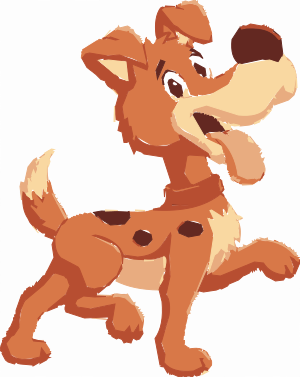

# svg-thumbnailer

## Overview

Convert almost any image into optimized SVG with NodeJS.

## Usage (lib)

```javascript
const toSvg = require('svg-thumbnailer')

const options = {}

const svgObj = await toSvg('./my/img.jpg', options)
const {data, info: {height, width}} = svgObj
```

## Options (= `default`)

- .colors = `4`
- .scale = `2`

### Optimizations

- .tolerance = `0.2` (range: `0.0 - 5.0`) - via [simplify-js](https://github.com/mourner/simplify-js)
  - tries to reduce amount of line points  (higher = less points).
- .combineLines = `false`
  - if `.tolerance > 0.0`, tries to combine svg line "shortcuts" into longer line segments. May help reduce amount of line points.

----

- .smooth = `0.0` (range: `0.0 - 0.5`) - WARNING: _significant_ increase of file size!
  - tries to round out harsh line corners with bezier curves (higher = more rounded).
- .smoothDecimalPlaces = `1` (range: `0 - 5`)
  - if `.smooth > 0.0`, tries to minimize the file size by rounding X,Y points of bezier curve handles (higher = more accurate).

## Usage (cli)

`npm install -g svg-thumbnailer`

`svg-thumbnailer {image-path} {options?}`

Eg. `svg-thumbnailer "/path/to/local/images/folder/img.jpg" --colors=4`

Eg. `svg-thumbnailer "/path/to/local/images/folder/" --colors=4`

- supports option: `--writeFileWithTag=svg`

## Quality

`$ npm t`

`$ npm run lint`

## Supported Filetypes

- .png
- .jpeg|.jpg

## Sample


`$ svg-thumbnailer ./resources/cartoon-dog.jpg --colors=4`


